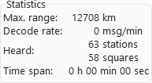

<pre>
 ########   ########    #######     ##     ##       ###       ########   ########    ########   ######## 
 ##            ##      ##     ##    ###   ###      ## ##      ##     ##  ##     ##   ##         ##     ##
 ##            ##      ##     ##    #### ####     ##   ##     ##     ##  ##     ##   ##         ##     ##
 ######        ##       #######     ## ### ##    ##     ##    ########   ########    ######     ######## 
 ##            ##      ##     ##    ##     ##    #########    ##         ##          ##         ##   ##  
 ##            ##      ##     ##    ##     ##    ##     ##    ##         ##          ##         ##    ## 
 ##            ##       #######     ##     ##    ##     ##    ##         ##          ########   ##     ##   v2.0
</pre>

## About The Project


ft8mapper is an offline map viewer for FT8 spots. It is minimalistic, requires no internet connection, stores received messages of the past 7 days, and shows statistics. It reads packets encoded in [the protocol](https://sourceforge.net/p/wsjt/wsjtx/ci/master/tree/Network/NetworkMessage.hpp) used by [WSJT-X](https://wsjt.sourceforge.io/wsjtx.html). It connects directly to the UDP output of WSJT-X on port 2237.

This repository is a fork of [ft8mapper v1.0](https://sourceforge.net/projects/ft8mapper/). Most parts of the code were refactored. The main contributions are:
* [Statistics](#stats) for a quick assessment of reception performance
* [Range rings](#map) and calculation of [bearing and range](#first-steps) from your location to all stations
* [Plotting](#plot) of several metrics versus time
* [Dark mode](#dark-mode) for night-time operation
* Improved list display with more [viewing and sorting options](#list) (number of messages, range, report, and age)
* [Example data](#example-data) included in the code for debugging and demonstration purposes
* Reworked UI controls
* Don't lose data: the app stays open when you close WSJT-X

This app is optimized for offline, e.g. portable use, and the monitoring part of FT8 - not [remote controlling WSJT-X](https://gridtracker.org/)!

### Built With

* [Python 3.10](https://www.python.org/)
* [Tkinter 8.6](https://docs.python.org/3/library/tkinter.html)
* [TKinterModernThemes 1.10.2](https://github.com/RobertJN64/TKinterModernThemes)
* [Pillow 10.3.0](https://python-pillow.org/)

## Getting Started

The following steps give instructions on setting up the app by cloning this repository. Python 3 with pip is required.

### Prerequisites

You need Python 3 with Tkinter to run this app.
* Under Linux, Python should ship with Tkinter by default.
* Under Windows, Tkinter is optional during setup. If Tkinter is missing, you can modify the installation by running the setup again, selecting "Modify" and then checking "tcl/tk and IDLE".
* Under Mac, an updated version of Python may be required.

### Installation

1. Clone the repository
   ```
   git clone https://github.com/byteneumann/ft8mapper.git
   ```
2. Create a virtual environment (recommended)
   ```
   cd ft8mapper
   python3 -m venv .ft8mapper
   ```
   and activate it with
   ```
   source .ft8mapper/bin/activate
   ```
   or under Windows
   ```
   .ft8mapper\Scripts\activate.bat
   ```
3. Install required packages
   ```
   pip install -r requirements.txt
   ```
4. Run the app
   ```
   python ft8mapper.py
   ```

## Usage

Setup your radio and run WSJT-X. It is assumed that your radio and WSJT-X are already configured and FT8 messages are decoded.

Make sure that "Accept UDP Requests" in the "Reporting" tab is checked.

### First Steps
When you start ft8mapper, you should start seeing locations of stations on the world map within 15 seconds.
The plotted location is based on the Maidenhead Locator System (Maidenhead locators are often referred to as "grid locators") included in messages transmitted by other stations. The dots are colored according to the band which the corresponding message was received on.


#### Hovering a station
Hover a station on the map to view callsign, Maidenhead locator, band, report, time of decoding, and message.
If you set a location for your own station, it calculated bearing and distance to the other station, too.

#### Clicking a station
Clicking on a station on the map or a callsign in the list will show the details permanently.

#### Double clicking a station
Double clicking on a station or callsign will open the webbrowser and look up the station's callsign on [QRZ.com](https://www.qrz.com/) or [HamCall.net](https://hamcall.net), as configured in the settings. Double clicking your own station (white color) will center the map instead.

### Map


When opened, the app displays the *World Map* (WM). There are separate maps for different regions of the world:
- *North America* (NA)
- *South America* (SA)
- *Europe* (EU)
- *Africa* (AF)
- *Asia* (AS), and
- *Oceania* (OC)

Two map scales are available. *large map* will show the map with twice the width and height.

#### Range rings

Range rings at
- 1000 km
- 2500 km
- 5000 km
- 10000 km, and
- 15000 km

can be plotted by ticking the *range rings* checkbox.

### View

#### Filters


The displayed data can be filtered by band and age. Two drop-down lists in the *View* section provide multiple options.

#### Dark mode


Additionally the app can be switched to use a dark mode theme, making it more comfortable when viewing at night.

### Statistics


Multiple statistics are calculated and displayed in the *Stats* section:
* *Max. range* is the distance on Earth's surface to farthest station based on transmitted Maidenhead locators. You can click on the distance to flash the corresponding station on the map.
* *Decode rate* is the average number of decoded messages per minute received from WSJT-X.
* *Heard* lists the number of unique stations (callsigns) and number of unique Maidenhead locators decoded.

These metrics aim at providing a simple estimate for your reception performance.

*Time Span* is equal to the age of the oldest message, i.e. the time since the start of decoding (unless *View* filters are set).
All calculated statistics use the [filter settings from the View section](#view-section)!

### Plot


Several metrics are available for plotting. All metrics are plotted versus time on the x-axis. You can select:
* *Decode rate*, i.e. the number of decoded messages per minute
* *Report*
* *Range*, i.e. the distance from your receiver location to a station based on Maidenhead locators
* *Stations*, i.e. the number of unique station callsigns heard
* *Grid*, i.e. the number of unique Maidenhead locators heard

The time basis is selectable independant from the age limit set for the map.
Here, the time basis is the total duration visible across the x-axis.
See this table as a guide for interpretation:

| Time Basis |  Per Bar |  Per Tic |
| ---------: | -------: | -------: |
|     7 day  |   6 hour |  24 hour |
|     3 day  |   6 hour |  24 hour |
|    24 hour |   1 hour |   4 hour |
|    12 hour |   1 hour |   4 hour |
|     6 hour |  15 min  |   1 hour |
|     3 hour |  15 min  |   1 hour |
|     1 hour |   1 min  |  15 min  |
|    30 min  |   1 min  |  10 min  |
|    15 min  |   1 min  |   5 min  |
|     5 min  |   1 min  |   1 min  |
|     1 min  |  15 sec  |  15 sec  |

When applicable minimum, mean, and maximum is shown with colored graphs. The minimum and maximum value is written next to the y-axis. The x-axis reaches from oldest on the left to newest on the right.

### List


The list to the right of the map can show many attributes. Clicking in the header sorts the list by this attribute. Callsigns are always shown.


The following attributes are available additionally:
* *Grid*: Maidenhead locator sent by the station
* *Range*: distances from your receiver location to each stations
* *Band*: band on which the station was heard
* *Age*: age of the latest message of each station
* *Report*: your reception reports
* *Msgs*: total number of messages received from each station
* *Last Msg*: last decoded message sent by each station.

If you click a callsign, the details for this station will be shown, double clicking looks up the callsign. If you click a Maidenhead locator in the list, the respective station will flash on the maps so you can see where it is located.

### Command line arguments

#### Example data

When passing `--example-stations` as an argument, many world cities are added to the map by faking decoded messages. This is useful when debugging or demonstrating and WSJT-X is not available.

#### Overwriting the receiver location

When passing `--rx-grid` with a Maidenhead locator, the receivers location is manually set. Normally WSJT-X forwards the station's location configured there.

## Contributing

If you found a bug, please [open a ticket](https://github.com/byteneumann/ft8mapper/issues/new?labels=bug&template=bug-report---.md). If you want to add a feature, you can fork this repository, work on it, and later come back to create a pull request here.

## License

Distributed under the GNU GPL Version 3. See `LICENSE.txt` for more information.

## Contact

Christian Neumann - byte.neumann@gmail.com  
Project link: [https://github.com/byteneumann/ft8mapper](https://github.com/byteneumann/ft8mapper)

## Acknowledgments

* [TCJC](https://sourceforge.net/u/hamradio/profile/) for [ft8mapper v1.0](https://sourceforge.net/projects/ft8mapper/).
  This repository is based on ft8mapper v1.0 by TCJC hosted at [https://sourceforge.net/projects/ft8mapper/](https://sourceforge.net/projects/ft8mapper/). The original README.txt is included as [README-1.0.txt](README-1.0.txt).
* All "OpenStreetMap contributors" for the maps.
